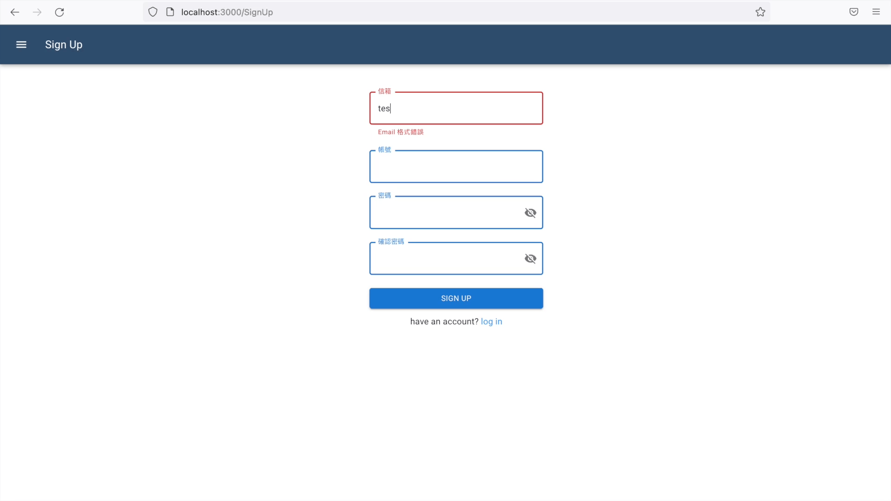
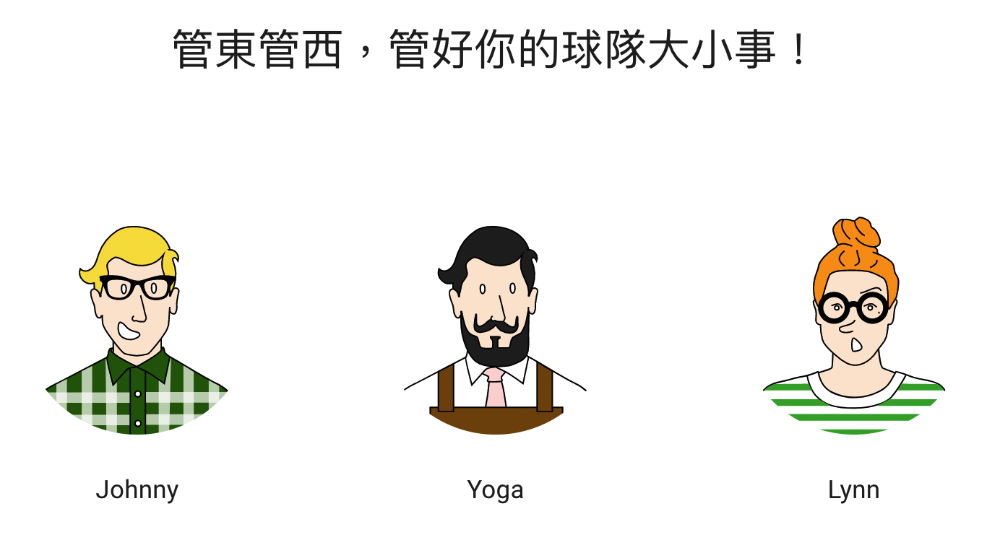

# ⚾ Kuan好你ㄉ事！讓我管好你的事！⚾

## 簡介
這是一個針對系上球隊開發，能夠簡單管理個人及球隊事務的網站。

在個人頁面中，使用者除了可以查看自己的日常行程外，還能清楚看到自己所在球隊的活動日程。

在球隊頁面則提供了公告訊息、投票、比賽紀錄、新增活動等功能，讓球隊幹部可以輕鬆傳達各種重要資訊。

透過這次的專案，希望能幫助到所有事情太多、煩不完的無力小老百姓。🥳

#### GitHub repo :  https://github.com/johnny890122/Web-Programming-Final  
#### 影片 demo: https://youtu.be/RN1N1_OHGTE
此為 110-1 黃鐘揚教授開設的「網路服務程式設計」期末專案。

## 如何在 localhost 安裝與測試
 1. Clone this repo: `git clone https://github.com/johnny890122/Web-Programming-Final`
 2. Install frontend & backend packages (You can choose one of them to install.)
  * (npm) `cd frontend` && `npm install`
  * (npm) `cd backend` && `npm install`
  * (yarn) `cd frontend` && `yarn add`
  * (yarn) `cd backend` && `yarn add`
 3. Set up database
  * Make a copy of `.env.defaults (./backend)` and rename it as `.env`
  * Fill in your `MONGO_URL` (Visit https://www.mongodb.com for more.)
 4. Open a terminal windows
  * (npm) `cd frontend` && `npm start`
  * (yarn) `cd frontend` && `yarn start`
 5. Open another terminal windows
  * (npm) `cd backend` && `npm run server`
  * (yarn) `cd backend` && `yarn server`
 6. Open http://localhost:3000 in your browser and enjoy! 

## 功能介紹
### ⚾ Sign up / Log in 頁面 :
#### Sign up
 * 初次使用需申請一個新的帳號，必要資訊為電子郵件、帳號、密碼。
 * 頁面有設計防呆機制，例如：帳號密碼長度、該帳號是否已被註冊等等，確保填寫的個人資料有效。
 * 密碼使用 bcryptjs 加密後存入資料庫。

#### Log in
 * 完成申請後使用該組帳號密碼登入。

### ⚾ User 個人頁面 :
#### User Setting
 * 首次登入須設定用戶名稱，用於個人及球隊頁面。
 * 後續的登入中，點擊右上角的設定修改用戶名稱，也可以查看帳戶資訊。

#### Dashboard
 * 使用者的個人主頁面，支援的功能如下：
   1. 創建個人事項，新增事項會顯示在畫面左方的 information card 中。
   2. 所屬的球隊裡，有人新增團隊事項，該團隊事項會同步更新在 information card 中，方便使用者查看。
   3. 點擊 infomation card 可以查看細節、刪除事項、更新內容；也可按照 Role（個人或是球隊）、Time（未來、已完成）等條件進行篩選。
   4. 畫面右上方會提示使用者近三天內到期的 event；右下方會通知使用者，所屬團隊新增的「事件」、「貼文」、「投票」。
   
#### Calendar
 * 以日曆的形式顯示 Dashboard 的「個人事項」和「團隊事項」。
 
#### Achievement
 * 顯示該使用者所獲得的成就，目前只有初次登入的獎勵。日後會新增其他勳章，例如在球隊的活躍度、比賽的 mvp 等等。

#### My Teams
 * 顯示使用者參加的所有團隊，點擊進入團隊頁面。
 * 使用者也可以在此創建自己的團隊，並加入已註冊的用戶做為團隊成員。

### ⚾ Team 頁面 :
#### Team Home 
 * 進入團隊頁面後，畫面左側新增該團隊專用的 NavBar，功能包含：Home、Event、Post、Member、Score、Vote。
 * 首頁顯示最近的活動、公告、投票、比賽紀錄。
 * 可點擊各區塊的 VIEW ALL 按鈕，跳轉到相對應頁面。
 
#### Event
 * 可依照條件篩選顯示的活動 (全部、未來、過去等)。
 * 點擊 CREATE 可新增活動，並顯示在團隊頁面及所有成員的個人頁面。
 * 點擊各活動的 MORE 鍵可觀看詳細內容，包括 :  
    1. 活動名稱  
    2. 活動建立人  
    3. 活動日期  
    4. 活動地點  
    5. 活動細節  
 * 在詳細內容中也可以修改及刪除活動，並且即時更新在團隊頁面及所有成員的個人頁面。  

#### Member (隊員資訊)
 * 顯示隊員資訊，包含隊員名稱、帳號、電子郵件、身分(是否為管理員)。
 * 管理員可新增、刪除團隊成員。
   
#### Post
 * 點擊 CREATE可新增公告文章。
 * 點擊各文章的 MORE 鍵可觀看詳細內容，包括 :  
    1. 文章標題  
    2. 文章作者  
    3. 發表日期  
    4. 文章內容  
 * 在詳細內容中也可以修改文章內容，以及刪除文章。  
  
#### Score  
 * 點擊 CREATE 可新增比賽紀錄。
 * 各 SCORE 區塊顯示各場比賽標題、對手、局數及比賽日期。 
 * 點擊 DELETE 按鈕可刪除該場比賽紀錄。
 * 點擊 SCORE 區塊進入各局詳細記錄，包含以下功能：
   1. 新增各局詳細紀錄。  
   2. 新增各局中裡，任意人數的球員個人比賽數據。  
   3. 點擊 Detail 可觀看詳細記錄單、編輯、刪除紀錄。  
  
#### Vote
 * 點擊 CREATE 可新增投票活動、設定截止時間及每人票數限制。  
 * 點擊投票活動可顯示詳細內容，包括 :  
    1. 投票題目  
    2. 截止時間
    3. 票數限制  
    4. 各選項及其得票數。  
 * 使用者勾選選項及可參與投票，票數會在下次檢視詳細內容時更新。  
 * 使用者取消勾選選項，即可取消投票。  

 ## About us
 * 特別感謝 Kurt 協助 Deployment 相關問題！
 

## 使用與參考之框架/模組/套件
### 前端
React-JS, Apollo GraphQL, MUI, Antd, Full Calendar, etc. 
### 後端
Node-JS, GraphQL
### 資料庫
MongoDB
